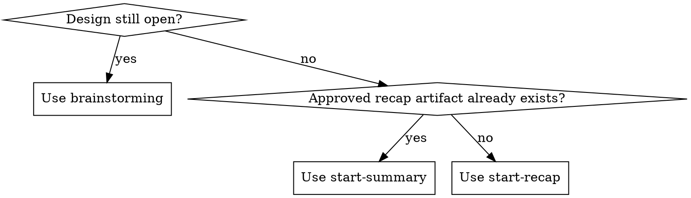

# Start Recap

## Overview

Turn a settled design discussion into one approved recap artifact before `start-summary` begins. This recap is not a casual summary. It is the engineered handoff that freezes what the conversation decided, records what it did not decide, and supplies the fields the next phase needs without forcing another agent to reconstruct intent from raw chat history.

## When to Use



- The design discussion is settled enough to stop brainstorming, but no deterministic recap artifact exists yet.
- The user asks for a recap, handoff, design conclusion, or clean summary before planning.
- The conversation contains conflicts, optional wording, or scope changes across multiple messages.
- `start-summary` would otherwise have to infer decisions from raw conversation history.

Do not use this skill when the design is still moving. That is a `brainstorming` problem.

Do not use this skill when an approved recap artifact already exists. That is a `start-summary` problem.

Do not use this skill to draft the spec or the plan. This stage ends before either document is written.

## Core Rules

1. Do not draft any part of the spec or plan. This skill ends at the recap artifact and user approval.
2. Re-read the full conversation with extra focus on the latest approved direction.
3. Separate confirmed decisions, resolved conflicts, locked assumptions, open questions, and reviewer focus points. Never mix them.
4. If a later approved message supersedes an earlier one, record that resolution explicitly instead of assuming the next agent will infer it.
5. If two mutually exclusive interpretations still remain and the conversation does not resolve them, ask one closure question. Do not reopen broad brainstorming.
6. Remove ambiguous wording such as `optional`, `should`, `could`, `if needed`, `as needed`, `可选`, or `可做可不做`. Convert each case into a requirement, non-goal, locked assumption, or explicit open question.
7. Write the recap to disk, show the recap contents or a faithful excerpt in-chat for quick review, and ask the user to approve it before invoking `start-summary`.
8. The next skill after an approved recap is `start-summary`. Do not jump directly to `writing-plans`.
9. Treat approval as explicit only. `approved`, `looks right`, or a direct change request counts. Silence or topic drift does not count.
10. If the environment is read-only or you are blocked from writing the recap artifact, state that the workflow cannot complete yet, present the exact recap content inline, and ask the user whether to proceed once write access exists. Do not pretend the artifact was written.
11. An inline-only review in a read-only environment is not enough to enter `start-summary`. After write access exists, write the recap artifact, re-read it fresh, show the written recap contents or a faithful excerpt again, and collect explicit approval against the on-disk artifact.
12. If another agent or the user writes the recap artifact before you do, re-read that on-disk artifact fresh, verify it still matches the approved direction, show it again, and collect explicit approval against the written artifact before entering `start-summary`.

## Default Path

- Respect user-provided paths first.
- Else respect repo doc conventions.
- Else use: `<repo>/docs/superpowers/recaps/YYYY-MM-DD-<slug>-recap.md`

Always report the absolute resolved path.

If the feature slug is ambiguous, derive it from the latest approved feature name. If that is still ambiguous, ask one naming question instead of guessing.

## Workflow

1. Announce: `I'm using start-recap to turn the settled discussion into an approved recap artifact for start-summary.`
2. Re-read the conversation and collect candidate truths.
3. Build a closure list with five buckets:
   - confirmed decisions
   - resolved conflicts
   - locked assumptions
   - remaining open questions
   - reviewer focus points
4. If the closure list still contains a blocking contradiction, ask one forced-choice closure question and wait for the answer.
5. Build the context packet fields that `start-summary` will need:
   - workspace or repo absolute path
   - important must-read file absolute paths
   - optional grep keywords
   - resolved absolute recap path
   - intended absolute spec path
   - intended absolute plan path
   - latest approved direction and what changed from earlier turns
6. Write the recap artifact.
7. Re-read the recap artifact fresh and remove any ambiguity or mixed buckets.
8. Show the recap contents or a faithful excerpt in-chat so the user can review without opening the file first.
9. Ask the user to review the recap artifact and give explicit approval.
10. Only after approval, invoke `start-summary`.

If the environment is read-only, replace steps 6 through 10 with:

6. Present the exact recap content inline and state that the artifact could not be written.
7. Ask whether to proceed once write access exists.
8. After write access exists, write the recap artifact, re-read it fresh, show it again, and collect explicit approval against the on-disk artifact.
9. Only after that approval, invoke `start-summary`.

## Recap Shape

The recap should be deterministic enough that `start-summary` can treat it as the starting truth.

```md
# <Feature Name> Final Recap

## Goal
## Non-Goals
## Confirmed Decisions
## Resolved Conflicts
## Locked Assumptions
## Remaining Open Questions
## Reviewer Focus Points
## Context Packet
```

The `Context Packet` section must include:

- Workspace or repo absolute path
- Must-read file absolute paths
- Optional grep keywords
- Absolute recap path
- Intended absolute spec path
- Intended absolute plan path
- Latest approved direction
- What changed from earlier directions

## Quick Reference

| Section | Must contain |
|---------|--------------|
| `Confirmed Decisions` | Facts the next phase should treat as settled |
| `Resolved Conflicts` | Earlier-vs-later decisions with the final ruling made explicit |
| `Locked Assumptions` | Chosen assumptions that remove implementation freedom |
| `Remaining Open Questions` | Only items that truly still need a decision |
| `Reviewer Focus Points` | Places where `start-summary` reviewers should read extra carefully |
| `Context Packet` | Paths, keywords, and handoff metadata for the next phase |

## Example

```md
## Resolved Conflicts
- Earlier discussion treated manual CSV import as optional for V1. The final approved direction removed it from V1. Final truth: V1 does not include manual CSV import.

## Locked Assumptions
- All workflow documents for this feature stay under `docs/superpowers/`.
- `start-summary` will derive the spec and plan from this recap instead of re-reading the entire discussion as the primary source.

## Reviewer Focus Points
- Verify the acceptance criteria stay aligned with the narrowed V1 scope and do not reintroduce CSV import.
- Verify every prior `optional` statement has been converted into a requirement, non-goal, assumption, or open question.

## Context Packet
- Workspace: `/repo`
- Must-read files: `/repo/README.md`, `/repo/SKILLS/start-summary/SKILL.md`
- Optional grep keywords: `csv import`, `v1 scope`, `acceptance criteria`
- Absolute recap path: `/repo/docs/superpowers/recaps/2026-04-13-data-sync-recap.md`
- Intended absolute spec path: `/repo/docs/superpowers/specs/2026-04-13-data-sync-design.md`
- Intended absolute plan path: `/repo/docs/superpowers/plans/2026-04-13-data-sync.md`
- Latest approved direction: V1 is automated sync only.
- What changed from earlier directions: manual import was discussed early, then explicitly removed from scope.
```

## Common Mistakes

- Writing a friendly summary instead of a deterministic recap artifact.
- Claiming the recap artifact was written when the environment was read-only or the write failed.
- Treating inline-only approval in a read-only environment as enough to start `start-summary`.
- Reusing stale inline approval after the on-disk recap changes or is first written later.
- Mixing recap content with downstream implementation instructions.
- Leaving `optional` or similar wording in place.
- Assuming the latest message overrides earlier conflict without recording the resolution.
- Skipping the user approval gate before `start-summary`.
- Jumping directly to `writing-plans` because it feels faster.

## Common Rationalizations

| Excuse | Reality |
|--------|---------|
| "A cleaned-up summary is enough" | `start-summary` needs a deterministic recap artifact, not a helpful paragraph. |
| "The latest direction probably reflects final intent" | Maybe, but the recap must record which earlier statements were superseded. |
| "Planning can resolve the remaining ambiguity" | No. This stage exists to classify ambiguity before spec review starts. |
| "The user said stop discussing, so I should not ask anything" | Ask one closure question if a real contradiction blocks a deterministic recap. |
| "I can just jump to writing-plans" | No. The plan must come from `start-summary` after the recap is approved and the spec is frozen. |
| "I can say the recap file exists and fill it in later" | No. If the file was not written, say so explicitly and stay in the recap stage. |
| "The user approved the inline recap, so I can skip the on-disk approval pass" | No. `start-summary` starts only after the written recap artifact exists, is re-read fresh, and is explicitly approved. |
| "Someone else wrote the recap file, so I can trust it without re-review" | No. Re-read the written artifact fresh, show it again, and collect explicit approval against that file. |

## Red Flags

- No written recap artifact
- The response names a recap path but does not show the recap contents or excerpt for user review
- `start-summary` begins from inline-only recap text while the recap artifact still does not exist on disk
- The workflow relies on approval captured before the on-disk artifact exists or after the artifact changed
- No `Resolved Conflicts` section even though the discussion changed over time
- `optional`, `should`, `could`, `if needed`, or similar wording remains
- The recap tells another agent what to build but does not say what was actually decided
- The context packet is missing paths, must-read files, or reviewer focus points
- The user has not explicitly approved the recap yet

## Completion

The workflow is complete only when:

1. The recap artifact is written to disk.
2. The recap has been re-read fresh and cleaned up.
3. The recap contents or excerpt have been shown in-chat for review.
4. The user has explicitly approved the recap artifact.
5. The next step is clearly `start-summary`.
